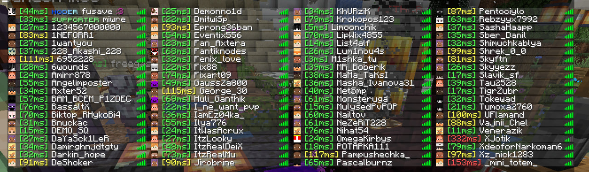

# PingDisplay

[English](#english) | [Русский](#русский)

---

## English

A Minecraft Fabric client-side mod that displays players' ping (latency) in the Tab list and on player nametags when looking at them.

### Features

- **Tab List Ping:** Appends numeric ping next to player names in the player overlay list (Tab).
- **Nametag Ping:** Displays the ping next to the player's nametag above their head.
- **Color-Coded Status:**
  - **Green**: `0 - 80 ms` (Excellent connection)
  - **Yellow**: `81 - 150 ms` (Moderate connection)
  - **Red**: `150+ ms` (High latency)

### Requirements

- Minecraft **1.21.4**
- Fabric Loader `>= 0.17.3`
- Fabric API (any build for 1.21.4)
- Java `>= 21`

---

## Русский

Клиентский Fabric-мод для Minecraft, который отображает пинг (задержку) игроков в списке Tab и над их головами при наведении.

### Возможности

- **Пинг в табе:** Добавляет числовое значение пинга рядом с ником игрока в списке игроков (Tab).
- **Пинг над головой:** Отображает пинг рядом с никнеймом над головой игрока.
- **Цветовое обозначение качества связи:**
  - **Зеленый**: `до 80 ms` (Отличное соединение)
  - **Желтый**: `81 - 150 ms` (Среднее соединение)
  - **Красный**: `выше 150 ms` (Высокая задержка)

### Требования

- Minecraft **1.21.4**
- Fabric Loader `>= 0.17.3`
- Fabric API для 1.21.4
- Java `>= 21`
